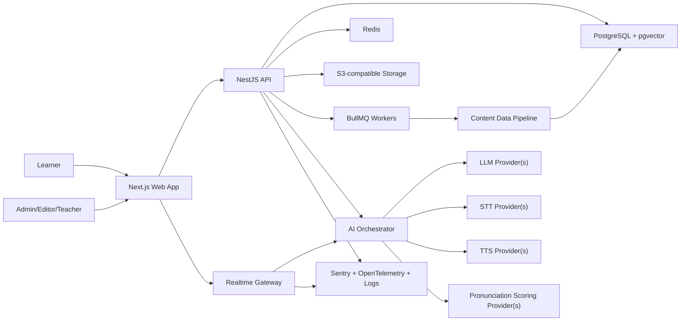
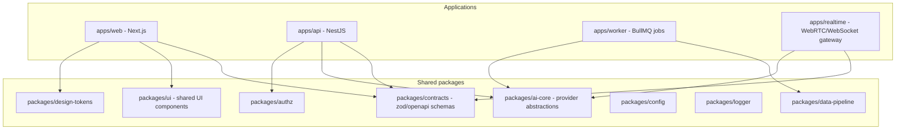
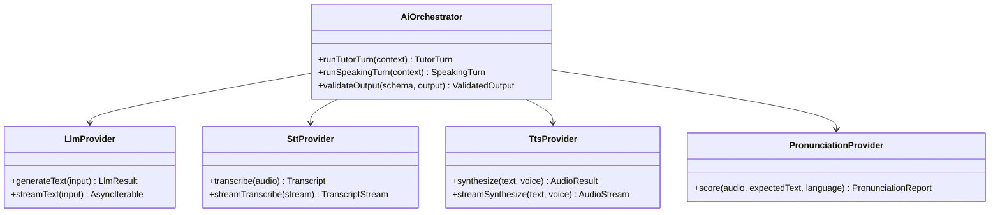
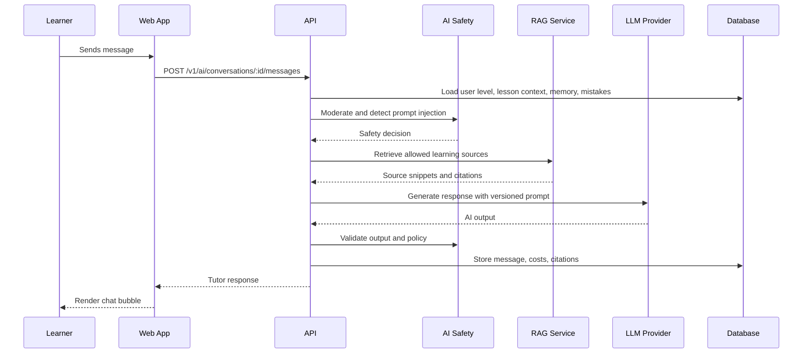
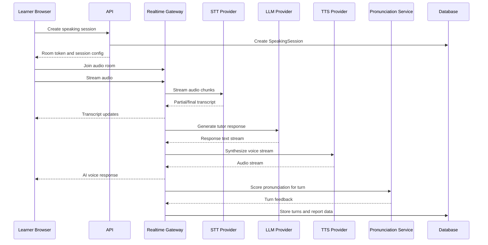
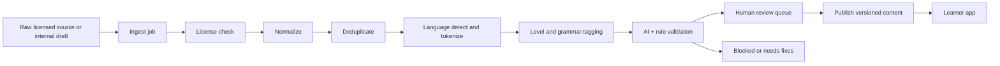
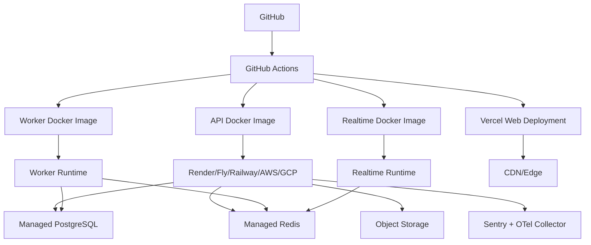
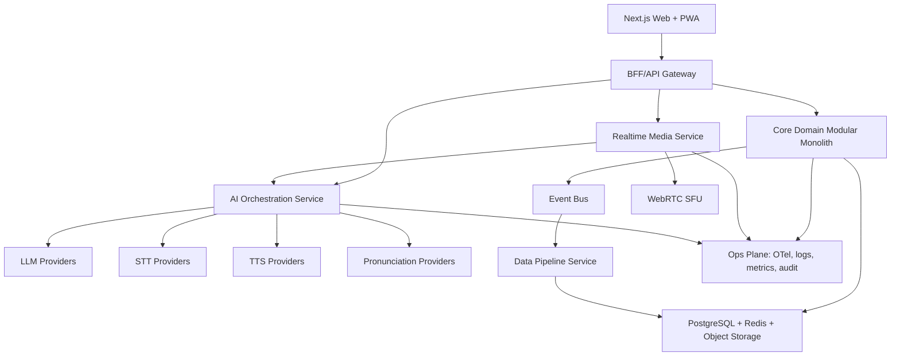

# Polyglot AI Academy - Architecture

## 1. Architecture goals

The architecture must support:

- Premium learner experience across public site, learner app, AI tutor, speaking room, and admin CMS.
- Secure-by-default backend with runtime validation, RBAC, object-level authorization, audit logs, rate limits, and privacy controls.
- AI provider abstraction for LLM, STT, TTS, pronunciation scoring, embeddings, and moderation.
- Data pipeline that prevents unlicensed or unvalidated content from being published.
- Scaling path from MVP to millions of users without rewriting core domain boundaries.

## 2. Recommended stack

Frontend:

- Next.js App Router.
- TypeScript strict mode.
- Tailwind CSS.
- shadcn/ui.
- Framer Motion.
- React Hook Form.
- Zod.
- TanStack Query.
- Zustand for local app state where needed.
- next-intl for UI localization.

Backend:

- NestJS for primary API.
- PostgreSQL.
- Prisma ORM.
- Redis.
- BullMQ.
- S3-compatible object storage for audio/images.
- WebSocket/WebRTC gateway for realtime.

AI:

- Provider abstraction layer.
- LLM adapters.
- STT adapters.
- TTS adapters.
- Pronunciation scoring adapter.
- RAG service with pgvector for MVP, Qdrant optional later.
- Prompt versioning.
- AI safety and cost tracking.

Infra:

- Docker.
- GitHub Actions.
- Vercel for frontend if desired.
- Managed PostgreSQL.
- Managed Redis.
- Object storage.
- CDN.
- Sentry and OpenTelemetry.

## 3. System context



## 4. Monorepo containers



## 5. Core domains

| Domain            | Responsibilities                                                   | Primary app      |
| ----------------- | ------------------------------------------------------------------ | ---------------- |
| Identity          | Auth, sessions, email verification, reset password, optional 2FA   | API              |
| User Profile      | goals, interests, target languages, level, schedule                | API/Web          |
| Learning Content  | course, module, lesson, lesson blocks, vocab, grammar, dialogues   | API/Admin        |
| Learning Activity | attempts, progress, SRS, mistake logs, skill progress              | API              |
| AI Tutor          | conversations, messages, prompt templates, safety, cost            | API/AI core      |
| Speaking          | sessions, turns, transcript, audio metadata, pronunciation reports | API/Realtime     |
| Data Governance   | sources, validation, quality score, publish workflow               | API/Worker/Admin |
| Admin             | RBAC, moderation, audit, content CMS                               | API/Web          |
| Billing           | subscription, payment, entitlements                                | API              |
| Analytics         | events, dashboards, AI cost, learning metrics                      | API/Worker       |
| SEO/CMS           | blog, public pages, metadata, JSON-LD                              | Web/API          |

## 6. Frontend architecture

Next.js route groups:

- `(public)`: landing, language pages, pricing, blog, policies.
- `(auth)`: login, register, reset, verify.
- `(learner)`: dashboard, course map, lesson player, AI tutor, speaking room, review.
- `(admin)`: admin dashboard, CMS, prompt manager, data source manager, moderation.
- `api` routes only when frontend-specific edge handlers are needed; primary backend remains NestJS.

Frontend principles:

- Server Components for public/SEO and non-sensitive static data.
- Client Components only for interactive UI: lesson player, chat, speaking room, forms.
- No secrets in client bundle. `NEXT_PUBLIC_*` only for public config.
- TanStack Query for server state.
- Zod schemas shared via `packages/contracts`.
- React Hook Form for validated forms.
- Zustand for short-lived UI state: active tutor persona, speaking room UI, local lesson player state.

## 7. Backend architecture

NestJS module layout:

- `AuthModule`
- `UsersModule`
- `ProfilesModule`
- `CoursesModule`
- `LessonsModule`
- `ExercisesModule`
- `ProgressModule`
- `AiChatModule`
- `SpeakingModule`
- `PronunciationModule`
- `ContentSourcesModule`
- `ContentValidationModule`
- `AdminModule`
- `BillingModule`
- `AnalyticsModule`
- `AuditModule`
- `NotificationsModule`

Cross-cutting:

- Global validation pipe.
- Standard error response.
- Request ID and structured logger.
- Rate limit guards.
- Auth guard.
- Permission guard.
- Object ownership policy helpers.
- Audit interceptor for admin mutations.

## 8. AI architecture

AI services:

- Tutor Chat Service.
- Speaking Coach Service.
- Pronunciation Scoring Service.
- Writing Correction Service.
- Lesson Generator Service.
- AI Safety Service.
- RAG Retrieval Service.
- AI Cost Tracking Service.

Provider abstraction:



AI safety controls:

- Prompt templates versioned.
- Output schema validation.
- PII masking before logs.
- Moderation pre-check and post-check.
- Prompt injection detection for user message and retrieved content.
- Source allowlist for RAG.
- Tool permission boundary.
- No raw system prompt exposure.

## 9. AI tutor chat sequence



## 10. Speaking realtime architecture

Recommended approach:

- Use LiveKit/WebRTC for audio room and low-latency transport.
- API owns session lifecycle and permissions.
- Realtime gateway orchestrates STT stream, LLM turn, TTS stream, transcript sync.
- Pronunciation scoring can run during or after turn depending provider capability.



Latency design target:

- Local transcript update: near realtime.
- AI first response token/audio: provider-dependent, target 800ms-1500ms where feasible.
- Report generation: async allowed after session end.

Fallback:

- If realtime unavailable, degrade to push-to-talk audio upload and async pronunciation report.

## 11. Data and content pipeline



Publish rule:

- No source record means no publish.
- No validation record means no publish.
- High-risk license means no publish.
- AI-generated lesson draft must pass AI/rule/human validation policy before publish.

## 12. Database strategy

MVP database:

- PostgreSQL for transactional data.
- Prisma for migrations and ORM.
- pgvector for embeddings where sufficient.
- Qdrant optional for larger vector workloads later.

Data classes:

- Public content: courses, lessons, blog.
- User private data: profile, progress, mistakes, attempts.
- Sensitive data: auth credentials, reset tokens, audio, chat transcripts, payment identifiers.
- Governance data: content sources, validations, audit logs.

Retention:

- Audio: default short retention unless user consents to longer storage.
- Chat: user-visible history retained while account active, deletable by user.
- Audit logs: retained per compliance policy, immutable append-only design.
- Analytics: aggregate/pseudonymous where possible.

## 13. API architecture

API style:

- REST for CRUD and core product workflows.
- WebSocket/WebRTC signaling for speaking realtime.
- OpenAPI generated from contracts where possible.
- Shared Zod schemas for request/response validation.

Versioning:

- `/v1/*` initial API.
- Breaking changes require `/v2` or backwards-compatible field addition.

Error format:

```json
{
  "error": {
    "code": "VALIDATION_ERROR",
    "message": "Dữ liệu không hợp lệ.",
    "requestId": "req_123",
    "details": []
  }
}
```

## 14. Security architecture

Controls:

- Argon2id or strong bcrypt password hashing.
- Session rotation or refresh token rotation.
- Email verification and reset token expiry.
- RBAC + permission-based checks.
- Object-level authorization.
- CSRF protection for cookie-auth state-changing endpoints.
- Strict CORS.
- Security headers and CSP.
- Runtime input validation.
- Sanitized rich text.
- Rate limits and request size limits.
- Audit log.
- Secrets via env/secret manager.
- PII redaction in logs.

AI-specific controls:

- Prompt injection defense.
- RAG source allowlist.
- Tool permission boundaries.
- Output schema validation.
- Moderation.
- No system prompt disclosure.
- Age-sensitive mode foundation.

## 15. Deployment architecture



Environments:

- Local.
- Preview.
- Staging.
- Production.

Deployment requirements:

- CI must run typecheck, lint, tests, dependency scan, secret scan.
- Migrations reviewed before production.
- Rollback plan for web/API/DB.
- Feature flags for risky AI/speaking features.

## 16. Observability

Telemetry:

- Request logs with request ID.
- API latency by endpoint.
- Error rate.
- DB query performance.
- Queue job failure/retry counts.
- AI provider latency/cost/error.
- Speaking session latency and disconnects.
- Admin audit log.

Tools:

- OpenTelemetry traces.
- Sentry errors.
- Structured JSON logs.
- Dashboard health checks.
- Alerting for critical API, auth, AI provider, realtime, job queue failures.

## 17. Scaling path

Phase 1:

- Single web app, API, worker, realtime service.
- Managed PostgreSQL + Redis.
- pgvector.

Phase 2:

- Split AI orchestration into dedicated service if traffic grows.
- Add read replicas.
- Dedicated vector DB.
- Dedicated analytics warehouse.
- Queue prioritization by feature/user tier.

Phase 3:

- Multi-region frontend/CDN.
- Regional realtime edges.
- Sharded high-volume event/audio metadata if needed.
- Enterprise tenant isolation if B2B emerges.

## 18. Architecture Done Criteria

- System boundaries are explicit.
- Realtime, AI, data pipeline, security, deployment and observability are diagrammed.
- Provider abstractions prevent lock-in.
- Content publish workflow blocks unvalidated/unlicensed data.
- Sensitive user/audio/chat data has retention and privacy posture.

## 19. Enterprise architecture upgrade

The target architecture is a modular monolith for business core with separate services for realtime media, AI orchestration and data pipeline.



Core domain services:

- tenant.
- users.
- groups.
- roles/permissions.
- courses.
- lessons.
- progress.
- assignments.
- analytics events.
- content workflow.
- audit.

BFF/API Gateway:

- Auth session.
- Anti-abuse.
- Feature flags.
- Tenant routing.
- API orchestration.
- Request shaping for web/PWA.

Realtime Media Service:

- WebRTC session control.
- SFU integration.
- TURN/STUN.
- QoS and reconnect.
- Bitrate fallback.
- Session token.

AI Orchestration Service:

- Model router.
- Provider abstraction.
- Policy checks.
- Grounding.
- Prompt versioning.
- Structured outputs.
- Cost tracking.
- Agent scope enforcement.

Enterprise data plane:

- PostgreSQL.
- pgvector.
- Redis.
- Object storage.
- Event bus.
- Tenant-aware analytics store later.

Ops plane:

- OpenTelemetry.
- Structured logs.
- Metrics.
- Distributed traces.
- Security scanning.
- Audit logs.
- Runbooks.

Supporting docs:

- `ENTERPRISE_REQUIREMENTS.md`
- `TENANT_ARCHITECTURE.md`
- `REALTIME_ARCHITECTURE.md`
- `AI_EVAL_PLAN.md`
- `OBSERVABILITY_RUNBOOK.md`
- `COMPLIANCE_MATRIX.md`
- `CONTENT_OPERATIONS.md`
- `VENDOR_DECISION_MATRIX.md`
