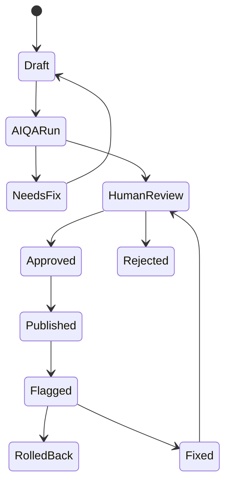

# Polyglot AI Academy - Content Operations

## 1. Content operations thesis

Content quality is an enterprise trust feature. The platform must operate with license-first, pedagogy-first, lineage-first, clean-room content workflows.

Non-negotiables:

- No gray crawling.
- No paywall bypass.
- No unlicensed training/display data.
- No AI-generated content published without validation.
- Every production content item has source, lineage, validation, version, and rollback path.

## 2. Content surfaces

Content types:

- Course.
- Module.
- Lesson.
- Lesson block.
- Vocabulary item.
- Grammar point.
- Dialogue.
- Sentence.
- Quiz item.
- Flashcard.
- Speaking scenario.
- Rubric.
- Tenant glossary term.
- Tenant document chunk.
- Prompt/policy template.

## 3. Source Registry

PR-008 implements the first tenant-scoped Source Registry in the API. Content versions now link to source IDs, and publish checks require approved, commercially cleared, unexpired source lineage. PR-009 adds a deterministic Content QA Agent gate and explicit published-version sync into learning runtime lessons.

Required fields:

- `source_id`
- `source_name`
- `url/reference`
- `license_type`
- `allowed_usage`: display, retrieval, train, eval, reference.
- `commercial_allowed`
- `attribution_required`
- `expiration_date`
- `data_residency_constraint`
- `risk_level`
- `last_reviewed_at`
- `reviewed_by`
- `notes`

Risk rules:

- `blocked`: cannot ingest or publish.
- `high`: sandbox only; legal/content lead approval required.
- `medium`: ingest allowed; human review required before production.
- `low`: normal validation workflow.

## 4. ETL and clean-room pipeline

```mermaid
flowchart LR
  Source["Approved Source"] --> Ingest["1. Ingestion"]
  Ingest --> Normalize["2. Normalization"]
  Normalize --> Dedupe["3. Deduplication"]
  Dedupe --> Annotate["4. Annotation"]
  Annotate --> Gate["5. Safety & Legality Gate"]
  Gate --> Review["6. Human Review"]
  Review --> Publish["7. Publish"]
  Publish --> Monitor["8. Monitor"]
  Monitor --> Rollback["9. Rollback if needed"]
```

Steps:

1. Ingestion:
   - Only ingest sources with clear rights.
   - Store raw artifact metadata and checksum.
2. Normalization:
   - Unicode normalization.
   - Punctuation cleanup.
   - Sentence splitting.
   - Locale tagging.
3. Deduplication:
   - Exact dedupe.
   - Fuzzy dedupe.
   - Contamination check.
   - License conflict detection.
4. Annotation:
   - Level tag.
   - Grammar point.
   - Topic.
   - Register.
   - Domain.
   - CEFR/JLPT/HSK/TOPIK mapping.
5. Safety and legality gate:
   - PII check.
   - Harmful content check.
   - Minors-sensitive content check.
   - License check.
6. Human review:
   - Linguist/editor approval.
7. Publish:
   - Versioned content.
   - Traceable lineage.
   - Rollback support.

## 5. Content quality scoring

100-point rubric:

| Dimension                   | Points |
| --------------------------- | -----: |
| License clarity             |     25 |
| Pedagogical fit             |     20 |
| Naturalness                 |     15 |
| Metadata completeness       |     10 |
| Level/topic/domain coverage |     10 |
| Cultural appropriateness    |     10 |
| Safety/bias                 |     10 |

Rules:

- > 80: may be used in production after required approvals.
- 60-80: reference or augmentation only.
- <60: rejected.
- Any blocked/high unresolved license risk overrides score and blocks publish.

## 6. Content Studio workflow

Roles:

- `content_editor`: creates and edits drafts.
- `linguist_reviewer`: approves language quality.
- `legal_reviewer`: approves source/license risk where needed.
- `content_admin`: publishes/rolls back.
- `security_auditor`: reviews sensitive tenant document workflows.

## 7. AI-assisted drafting

AI can:

- Draft lesson outlines.
- Generate dialogue variants.
- Suggest quiz distractors.
- Draft speaking scenarios.
- Suggest remediation drills.
- Flag level mismatch.
- Flag missing source/metadata.

AI cannot:

- Publish content.
- Invent citations.
- Use unapproved tenant documents outside tenant scope.
- Copy copyrighted material.
- Override license risk.
- Train on customer data without opt-in.

Required metadata:

- model provider.
- model ID.
- prompt version.
- policy version.
- source IDs.
- generated_at.
- reviewer.
- validation result.

## 8. Review queue

Queue dimensions:

- content type.
- language.
- level.
- tenant/global.
- risk level.
- source/license status.
- AI QA result.
- assigned reviewer.
- SLA age.

Prioritization:

- Published content flagged by learners.
- Enterprise tenant custom content.
- High usage lessons.
- New source imports.
- Exam path content.

## 9. Publish and rollback

Publish requirements:

- Source registry record exists.
- License allows intended usage.
- Content QA result is `passed`.
- Content quality score threshold met.
- AI/rule validations pass.
- Human review complete where required.
- Version notes present.

Rollback requirements:

- Previous version is retained.
- Assignments point to a recoverable version.
- Learner progress remains linked to completed version.
- Audit event records rollback reason.
- Affected tenants can be identified.

## 10. Content Operations Done Criteria

- Source registry supports license, usage, residency, risk and reviewer metadata.
- ETL pipeline is clean-room and lineage-first.
- Quality scoring is numeric and production-gated.
- AI-assisted drafting cannot publish.
- Human review and rollback workflows are defined.
