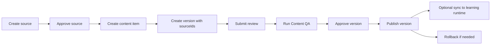

# Content Quality Workflow

## Current PR-009 Workflow

## Review Gates

Submit review and the explicit QA endpoint create deterministic QA metadata:

- content shape check
- lineage present check
- source approval check
- lesson level metadata check
- prompt injection policy lint

Approve and publish require `aiQa.status=passed`.

Publish runs license validation:

- source exists in tenant
- source status is approved
- commercial use is allowed
- license is not expired
- allowed usage includes display or reference

## Audit Events

Important actions write audit events:

- `source:create`
- `source:update`
- `source:approve`
- `content_item:create`
- `content_version:create`
- `content:submit_review`
- `content:ai_qa`
- `content:approve`
- `content:publish`
- `content:sync_learning`
- `content:rollback`

Denied permission checks are audited for write/review/publish operations when an actor exists.

## Publish Sync

Publish sync is intentionally not automatic. A tenant admin must call:

`POST /v1/admin/content/items/:itemId/versions/:versionId/sync-learning`

The version must already be published. PR-009 syncs only supported lesson scalar fields into an existing `Lesson` record and stores `validation.runtimeSync` on the content version.

## Future Work

- External AI Content QA Agent provider with eval gating.
- Citation/license validator against richer source metadata.
- Review assignment and reviewer ownership.
- Block/exercise materialization into Course/Lesson runtime tables.
- Tamper-evident review event chain.
- Source ingestion quarantine and malware scanning for uploads.
