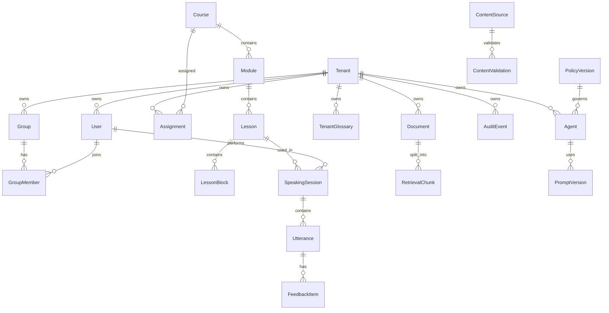

# Polyglot AI Academy - Database Schema

## 1. Schema principles

- UUID/CUID public IDs, no sequential public IDs.
- Every tenant-owned table includes `tenant_id`.
- Composite indexes start with `tenant_id` for tenant-scoped queries.
- Sensitive data has retention and access policy.
- Content has source, validation, lineage and version.
- AI outputs track model, prompt, policy, source and schema versions.

## 2. Enterprise ERD

## 3. Core enterprise tables

### Tenant

Purpose:

- Enterprise account boundary.

Fields:

- `id`
- `name`
- `region`
- `plan`
- `data_residency`
- `feature_flags` jsonb
- `branding_config` jsonb
- `retention_policy` jsonb
- `created_at`
- `updated_at`

Indexes:

- unique `name` where needed.
- `region`, `plan`.

Security:

- Tenant config changes require tenant admin or super admin.
- Audit every update.

### User

Purpose:

- Identity for learner/admin/manager.

Fields:

- `id`
- `tenant_id`
- `email`
- `display_name`
- `status`
- `locale`
- `time_zone`
- `last_login_at`
- `created_at`

Indexes:

- unique `(tenant_id, email)`.
- `(tenant_id, status)`.

Security:

- Email is PII.
- User access scoped by tenant and role.

### Group

Fields:

- `id`
- `tenant_id`
- `name`
- `manager_id`
- `external_id`
- `created_at`

Indexes:

- `(tenant_id, manager_id)`.
- unique `(tenant_id, external_id)` when SCIM-managed.

### Assignment

Fields:

- `id`
- `tenant_id`
- `group_id`
- `course_id`
- `due_date`
- `status`
- `created_by`
- `created_at`

Indexes:

- `(tenant_id, group_id, status)`.
- `(tenant_id, due_date)`.

### Agent

Fields:

- `id`
- `tenant_id`
- `scope`
- `allowed_tools` jsonb
- `prompt_version`
- `policy_version`
- `output_schema` jsonb
- `status`
- `created_at`

Indexes:

- `(tenant_id, scope, status)`.

Security:

- Tool allow-list enforced server-side.
- Prompt/policy changes audited.

### TenantGlossary

Fields:

- `id`
- `tenant_id`
- `term`
- `definition`
- `language`
- `domain`
- `approved_by`
- `status`
- `version`

Indexes:

- `(tenant_id, language, term)`.
- `(tenant_id, domain)`.

### Document

Fields:

- `id`
- `tenant_id`
- `source_type`
- `license_type`
- `uri`
- `checksum`
- `status`
- `created_at`

Indexes:

- `(tenant_id, status)`.
- unique `(tenant_id, checksum)`.

Retention:

- Per tenant policy. Deletion removes chunks and embeddings.

### RetrievalChunk

Fields:

- `id`
- `document_id`
- `tenant_id`
- `embedding`
- `text`
- `level_tag`
- `safety_tag`
- `access_scope`
- `created_at`

Indexes:

- `(tenant_id, document_id)`.
- vector index on `embedding`.
- `(tenant_id, access_scope)`.

Security:

- Retrieval must filter tenant and access scope.

### SpeakingSession

Fields:

- `id`
- `tenant_id`
- `user_id`
- `lesson_id`
- `stt_provider`
- `tts_provider`
- `llm_provider`
- `status`
- `latency_ms`
- `cost_estimate`
- `started_at`
- `ended_at`

Indexes:

- `(tenant_id, user_id, started_at)`.
- `(tenant_id, lesson_id)`.
- `(tenant_id, status)`.

### Utterance

Fields:

- `id`
- `session_id`
- `speaker`
- `raw_audio_uri`
- `transcript_raw`
- `transcript_normalized`
- `romanization`
- `confidence`
- `language`
- `grammar_tags` jsonb
- `level_tag`
- `tts_voice_profile`
- `created_at`

Retention:

- Audio short retention by default.
- Transcript per tenant/user policy.

### FeedbackItem

Fields:

- `id`
- `utterance_id`
- `category`
- `severity`
- `suggestion`
- `rubric_tag`
- `confidence`
- `created_at`

### AuditEvent

Fields:

- `id`
- `tenant_id`
- `actor_id`
- `action`
- `resource_type`
- `resource_id`
- `before` jsonb
- `after` jsonb
- `ip`
- `user_agent`
- `created_at`

Indexes:

- `(tenant_id, created_at)`.
- `(tenant_id, actor_id, created_at)`.
- `(tenant_id, resource_type, resource_id)`.

Retention:

- Compliance retention. Immutable append-only design.

### PromptVersion

Fields:

- `id`
- `agent_id`
- `version`
- `prompt_text`
- `input_schema` jsonb
- `output_schema` jsonb
- `safety_rules` jsonb
- `eval_status`
- `approved_by`
- `created_at`

Security:

- Do not expose prompt text to learners.
- Changes require approval and audit.

### PolicyVersion

Fields:

- `id`
- `scope`
- `version`
- `rules` jsonb
- `approved_by`
- `effective_from`
- `created_at`

## 4. Existing learning/content tables

Maintain tables from the original domain model:

- UserProfile.
- UserGoal.
- Language.
- LanguageLevel.
- PlacementTest.
- Course.
- Module.
- Lesson.
- LessonBlock.
- VocabularyItem.
- GrammarPoint.
- Dialogue.
- Sentence.
- Exercise.
- ExerciseAttempt.
- Quiz.
- QuizAttempt.
- Flashcard.
- SrsReview.
- WritingSubmission.
- AIFeedback.
- AITutorProfile.
- AIConversation.
- AIMessage.
- LearningPlan.
- SkillProgress.
- MistakeLog.
- ContentSource.
- ContentValidation.
- Subscription.
- Payment.
- Notification.
- BlogPost.
- SEOPage.

Enterprise rule:

- Add `tenant_id` to user/private/assignment/custom content records.
- Shared global content can have `tenant_id = null` plus explicit publish scope.

## 5. Database Done Criteria

- Tenant-owned entities include tenant scope.
- Enterprise entities from addendum are modeled.
- Speaking transcript/audio metadata supports CJK/i18n requirements.
- Retrieval chunks cannot be queried without tenant/access scope.
- Audit and prompt/policy versioning are first-class.
