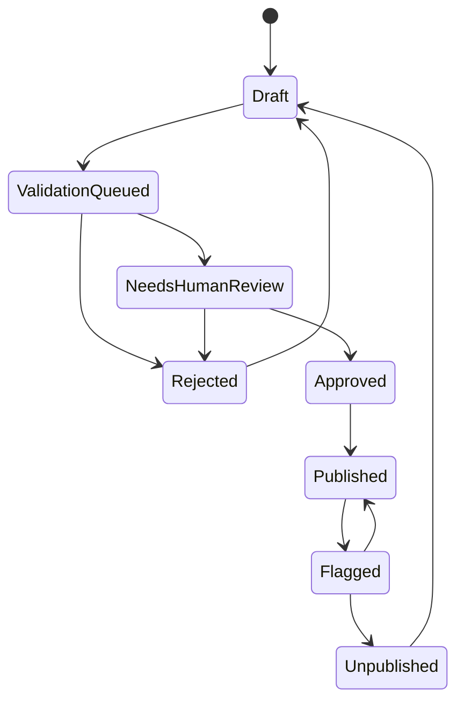

# Polyglot AI Academy - Data Strategy

## 1. Data principles

- Không scrape trái phép.
- Không bypass paywall.
- Không copy khóa học trả phí hoặc nội dung có bản quyền không rõ license.
- Không publish nội dung AI sinh nếu chưa qua validation.
- Mỗi nội dung học tập published phải truy vết được nguồn, license, validation, quality score, version.
- Dữ liệu người dùng thuộc về người dùng: cần consent rõ ràng, retention rõ ràng, quyền xóa rõ ràng.

## 2. Five-layer learning data strategy

### Layer 1: Chuẩn năng lực

Purpose:

- Xây taxonomy nội bộ để map level, skill, vocabulary, grammar, task.

Inputs:

- English: CEFR A1-C2, IELTS/TOEIC/TOEFL learning paths.
- Chinese: HSK 1-6/9, pinyin, tone, character writing.
- Japanese: JLPT N5-N1, kana, kanji, pitch accent basics.
- Korean: TOPIK I-II, Hangul, particles, honorifics.

Internal objects:

- `Language`
- `LanguageLevel`
- `Skill`
- `CanDoStatement`
- `ExamPath`
- `Topic`
- `GrammarTag`
- `PronunciationFeature`

Rules:

- External standards are used as reference frameworks, not copied as proprietary lesson content.
- Internal mapping must be versioned.
- Any exam-specific claim must be reviewed by content lead.

### Layer 2: Open datasets

Allowed-source candidates, pending license review:

| Source                              | Use case                                                                          | Notes                                                  |
| ----------------------------------- | --------------------------------------------------------------------------------- | ------------------------------------------------------ |
| Mozilla Common Voice                | Speech samples for evaluation/research, not direct user-facing content by default | Verify language coverage and license terms per release |
| LibriSpeech/OpenSLR                 | English speech research/evaluation                                                | Verify dataset license and attribution                 |
| AISHELL/OpenSLR                     | Mandarin speech research/evaluation                                               | Verify license and allowed commercial use              |
| Tatoeba                             | Sentence pairs/examples                                                           | Verify license and attribution                         |
| Wiktionary/Wikidata/Wikipedia dumps | Lexical/background data                                                           | Follow license and attribution requirements            |
| JMdict                              | Japanese dictionary                                                               | Follow license/attribution                             |
| CC-CEDICT                           | Chinese-English dictionary                                                        | Follow license/attribution                             |
| Korean open dictionary/datasets     | Korean lexical data                                                               | Use only if license and commercial allowance are clear |

Rules:

- Each dataset must have a `ContentSource` record before ingestion.
- If license is unclear, source is blocked.
- If attribution is required, attribution must be represented in product/legal pages or content metadata.
- Commercial use must be explicit or legally approved.

### Layer 3: Nội dung tự tạo

Content creation flow:

- Curriculum team defines taxonomy and lesson objectives.
- AI may generate lesson draft from approved taxonomy and sources.
- AI output is saved as draft only.
- Rule-based validator checks structure, level, banned claims, source references.
- AI evaluator checks factual consistency and level fit.
- Human reviewer approves or rejects.
- Only approved content can be published.

Rules:

- AI-generated content is never automatically published.
- Every vocabulary/grammar/sentence/dialogue must link to source and validation.
- Generated variants must inherit source and validation lineage.

### Layer 4: User-generated learning data

Data types:

- Pronunciation mistakes.
- Grammar mistakes.
- Writing submissions.
- Speaking audio.
- Transcript.
- Learning history.
- User feedback.

Consent:

- Product use consent: needed to process data for lesson/report.
- Improvement/training consent: separate and optional.
- Marketing/testimonial consent: separate and optional.

Rules:

- Do not use raw audio to train models without explicit opt-in.
- Provide deletion controls for user learning data.
- Default audio retention should be short and configurable.
- Store derived scores separately from raw audio.

### Layer 5: Quality cross-check

Validation policy:

- Important grammar/vocabulary knowledge should be cross-checked against at least two trusted sources where feasible.
- AI evaluator plus rule-based validator plus human review for publish-critical content.
- Quality score required.
- Suspect content must be flagged and removed from publish pipeline.

Quality score draft:

```text
quality_score =
  0.30 source_reliability
+ 0.20 license_confidence
+ 0.20 validation_confidence
+ 0.15 human_review_score
+ 0.10 learner_feedback_score
+ 0.05 freshness_score
```

Publish thresholds:

- `>= 0.85`: publish allowed if validation status is approved.
- `0.70-0.84`: publish allowed only with human approval.
- `< 0.70`: blocked.
- Any high license risk: blocked regardless of score.

## 3. Data pipeline

```mermaid
flowchart LR
  Source["ContentSource approved"] --> Ingest["Ingest raw data"]
  Ingest --> StoreRaw["Store raw artifact metadata"]
  StoreRaw --> Normalize["Normalize encoding and schema"]
  Normalize --> License["License check"]
  License --> Dedupe["Deduplicate"]
  Dedupe --> LangDetect["Language detection"]
  LangDetect --> Tokenize["Tokenization and segmentation"]
  Tokenize --> Level["Level estimation"]
  Level --> Grammar["Grammar tagging"]
  Grammar --> Align["Audio alignment if audio exists"]
  Align --> Validate["AI and rule validation"]
  Validate --> Queue["Human review queue"]
  Queue --> Publish["Publish versioned content"]
  Publish --> Monitor["Learner feedback and quality monitoring"]
  Monitor --> Rollback["Rollback if issue confirmed"]
```



Pipeline steps:

1. Ingest raw data.
2. Normalize schema, encoding, language tags, attribution fields.
3. Deduplicate exact and near-duplicate records.
4. Run license check against `ContentSource`.
5. Run language detection.
6. Tokenize and segment by language.
7. Estimate level.
8. Tag grammar, vocabulary, pronunciation features.
9. Align audio/text when applicable.
10. Run AI validator and rule validator.
11. Push to human review queue.
12. Publish versioned content.
13. Monitor feedback, errors, quality score.
14. Rollback or unpublish if issue is confirmed.

## 4. Source registry model

`ContentSource` required fields:

| Field                  | Type          | Purpose                                      |
| ---------------------- | ------------- | -------------------------------------------- |
| `id`                   | uuid          | Internal source ID                           |
| `name`                 | text          | Human-readable source name                   |
| `url`                  | text nullable | Public URL when available                    |
| `reference`            | text nullable | Citation/reference details                   |
| `license`              | text          | License name/version                         |
| `allowed_usage`        | enum/text     | Product, research, evaluation, internal-only |
| `attribution_required` | boolean       | Whether attribution is required              |
| `commercial_allowed`   | boolean       | Whether commercial use is allowed            |
| `last_checked_at`      | timestamp     | Last license review                          |
| `risk_level`           | enum          | low, medium, high, blocked                   |
| `notes`                | text          | Legal/content notes                          |
| `created_by`           | uuid          | Admin user                                   |
| `updated_by`           | uuid          | Admin user                                   |

Risk rules:

- `blocked`: ingestion disabled, publish disabled.
- `high`: ingestion allowed only in sandbox, publish disabled until legal approval.
- `medium`: ingestion allowed, publish requires human review.
- `low`: normal validation pipeline.

## 5. Content validation model

`ContentValidation` required fields:

| Field                | Type               | Purpose                                               |
| -------------------- | ------------------ | ----------------------------------------------------- |
| `id`                 | uuid               | Validation ID                                         |
| `content_id`         | uuid               | Target content record                                 |
| `content_type`       | enum               | vocabulary, grammar, sentence, dialogue, lesson, quiz |
| `validator_type`     | enum               | AI, rule, human                                       |
| `result`             | enum               | passed, failed, needs_review                          |
| `confidence`         | decimal            | 0-1 confidence                                        |
| `issues`             | jsonb              | Structured issues                                     |
| `reviewed_by`        | uuid nullable      | Human reviewer                                        |
| `reviewed_at`        | timestamp nullable | Review time                                           |
| `prompt_template_id` | uuid nullable      | AI validator prompt version if AI                     |
| `created_at`         | timestamp          | Created time                                          |

Validation examples:

- Grammar explanation mismatches level.
- Vocabulary translation ambiguous.
- Sentence unnatural for target language.
- Tone/pitch/accent note unsupported by source.
- Missing attribution.
- License does not allow commercial use.
- Potential copyrighted content.

## 6. Content states



State rules:

- `Draft`: visible only to editor/admin.
- `ValidationQueued`: locked for publish.
- `NeedsHumanReview`: requires reviewer.
- `Approved`: publishable.
- `Published`: visible to learners.
- `Flagged`: visible status depends severity; high severity auto-unpublish.
- `Unpublished`: hidden but retained for audit/version history.
- `Rejected`: cannot publish.

## 7. Language-specific pipeline notes

English:

- CEFR level estimation.
- Pronunciation features: phoneme, stress, rhythm, intonation.
- Exam path tags: IELTS/TOEIC/TOEFL.

Chinese:

- Pinyin normalization.
- Tone validation.
- Character, simplified/traditional metadata.
- HSK level mapping.

Japanese:

- Kana/kanji segmentation.
- JLPT mapping.
- Pitch accent field optional when source confidence is adequate.
- Furigana support.

Korean:

- Hangul decomposition for pronunciation drills.
- Batchim and liaison tags.
- TOPIK mapping.
- Honorifics and particles tagging.

## 8. AI-generated content rules

AI may generate:

- Lesson drafts.
- Dialogue variants.
- Quiz distractors.
- Personalized drills.
- Writing prompts.
- Roleplay scenarios.

AI must not:

- Claim unsupported grammar facts.
- Invent source citations.
- Publish directly.
- Copy user private data into shared content.
- Generate copyrighted or paywalled content.
- Use raw user audio/transcripts for training without consent.

Required metadata for AI-generated content:

- `generated_by_model`.
- `generation_prompt_template_id`.
- `input_taxonomy_version`.
- `source_ids`.
- `validation_status`.
- `quality_score`.
- `human_review_required`.

## 9. Sample legal dataset plan for MVP

MVP sample data should be small but clean:

- Internal taxonomy for four languages.
- Hand-authored sample lessons by project team.
- Public dictionary entries only from approved sources with attribution.
- Synthetic dialogues written from scratch and reviewed.
- Mock pronunciation report fixtures clearly marked as mock until provider integration.

Do not include:

- Copied textbook dialogues.
- Paywalled test prep questions.
- Scraped course material.
- Unverified Korean datasets.
- Raw audio datasets unless license/attribution/commercial usage is reviewed.

## 10. Data privacy and retention

Default retention proposal:

| Data                 | Default retention                | User deletion                              | Notes                      |
| -------------------- | -------------------------------- | ------------------------------------------ | -------------------------- |
| Profile              | Account lifetime                 | Yes                                        | Needed for personalization |
| Progress             | Account lifetime                 | Yes                                        | Can export/delete          |
| Mistake logs         | Account lifetime                 | Yes                                        | Used for review queue      |
| Chat messages        | Account lifetime or user setting | Yes                                        | Mask PII in logs           |
| Speaking audio       | 7-30 days by default             | Yes                                        | Longer only with consent   |
| Transcript           | Account lifetime or user setting | Yes                                        | Used for report/history    |
| Pronunciation scores | Account lifetime                 | Yes                                        | Derived learning data      |
| Audit logs           | Compliance retention             | Limited                                    | Admin/security record      |
| Analytics            | Aggregated/pseudonymous          | N/A or deletion by user ID if identifiable | Avoid raw PII              |

## 11. Data quality monitoring

Signals:

- Learner feedback reports.
- Low exercise success rate outliers.
- High skip rate.
- AI evaluator disagreement.
- Human reviewer rejection rate.
- Duplicate detection hits.
- Source risk changes.

Actions:

- Auto-flag content below quality threshold.
- Create moderation/content issue ticket.
- Unpublish severe errors.
- Version rollback if a batch is bad.
- Re-run validation when source license changes.

## 12. Data Strategy Done Criteria

- Every content source has license, allowed usage, risk level, and last checked date.
- Every published learning item has source and validation records.
- AI-generated content cannot bypass review.
- User audio/chat has consent and retention policy.
- Ambiguous license means blocked, not assumed safe.

## 13. Enterprise data architecture upgrade

Enterprise data principles:

- License-first.
- Pedagogy-first.
- Lineage-first.
- Clean-room pipeline.
- Tenant-scoped retrieval.
- Customer data is not used to train foundation models without explicit opt-in.

Additional source registry fields:

- `expiration_date`.
- `data_residency_constraint`.
- `reviewed_by`.
- `allowed_usage`: display, retrieval, train, eval, reference.

Enterprise ETL additions:

- Unicode normalization.
- Punctuation cleanup.
- Locale tagging.
- Exact and fuzzy dedupe.
- Contamination check.
- License conflict detection.
- Register and domain tagging.
- Safety/bias gate.
- Minors-sensitive content gate.
- Human linguist/editor approval.
- Versioned publish and rollback.

Content quality scoring is now 100 points:

| Dimension                   | Points |
| --------------------------- | -----: |
| License clarity             |     25 |
| Pedagogical fit             |     20 |
| Naturalness                 |     15 |
| Metadata completeness       |     10 |
| Level/topic/domain coverage |     10 |
| Cultural appropriateness    |     10 |
| Safety/bias                 |     10 |

Usage rule:

- > 80: production eligible.
- 60-80: reference/augmentation only.
- <60: reject.

Tenant data additions:

- Tenant documents are quarantined before indexing.
- Retrieval chunks include `tenant_id`, `access_scope`, `safety_tag` and source lineage.
- Tenant glossary entries are versioned and approved before grounding.
- Transcript records store raw text, normalized text, romanization, language tag, grammar tag, level tag and TTS voice profile.
