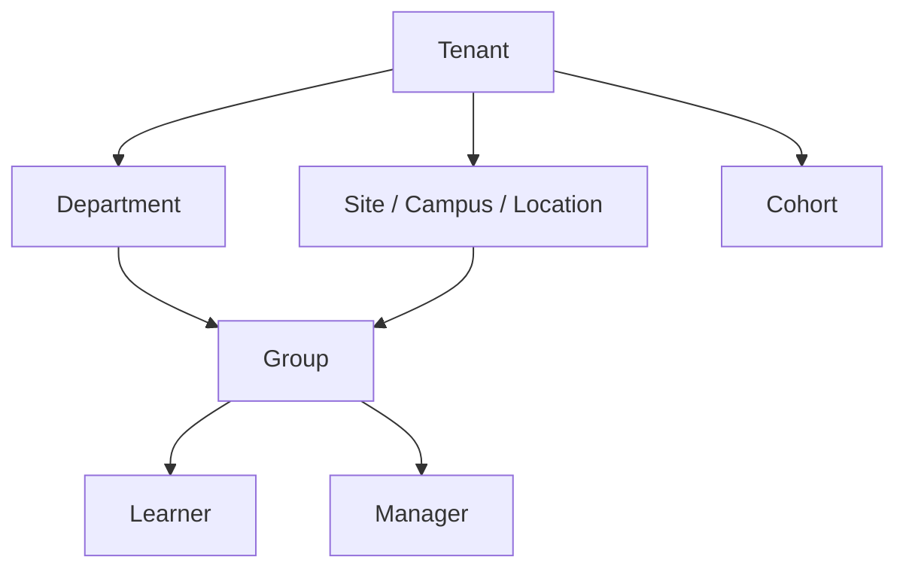

# Polyglot AI Academy - Enterprise Requirements

## 1. Enterprise product thesis

Polyglot AI Academy is now defined as an enterprise-grade language learning SaaS first, with B2C self-serve as a later channel on the same platform. The product must solve measurable speaking outcomes for organizations that need language capability at scale: internal training, customer support, hospitality, sales, cross-border workforce, language centers, schools, and international programs.

Enterprise contract blockers are first-class scope:

- Multi-tenant isolation.
- Tenant branding.
- SSO with OAuth 2.0/OpenID Connect.
- SAML bridge where needed for legacy enterprise identity.
- SCIM v1 provisioning.
- RBAC plus ABAC.
- Audit log.
- Cohort analytics and exportable reports.
- Manager/L&D dashboard.
- Assignments by group, department, or cohort.
- Tenant-specific glossary and AI agents.
- Data residency configuration.
- Feature flags by tenant.

## 2. Business assumptions

| Area                | Assumption                                                          | Product implication                                        |
| ------------------- | ------------------------------------------------------------------- | ---------------------------------------------------------- |
| Primary motion      | B2B/B2B2C first                                                     | Tenant admin, contracts, cohorts, reporting, SSO are core  |
| Buyer               | HR, L&D, operations, training center director, school administrator | ROI narrative must focus on speaking outcomes and adoption |
| End user            | Learner in a tenant context                                         | Learner UX must be fast, mobile-friendly, low-friction     |
| Budget owner        | L&D, HR, operations, academic program                               | Reports and manager dashboards must prove value            |
| Procurement blocker | Security, privacy, integration, data residency                      | Compliance matrix, DPA, audit logs, SSO, SCIM required     |
| Expansion lever     | More cohorts, sites, departments, languages                         | Feature flags and tenant hierarchy needed                  |

## 3. Buyer personas

### L&D Director

Goals:

- Improve workforce speaking confidence.
- Prove progress by team and role.
- Assign learning paths by department.
- Export reports for leadership.

Must-have workflows:

- Create cohort.
- Assign course/path.
- Track completion and speaking minutes.
- Identify at-risk learners.
- Export CSV/PDF report.

### Operations Leader

Goals:

- Improve customer-facing language readiness.
- Train role-specific scenarios for hospitality, support, sales, or cross-border operations.
- Reduce mistakes in real work conversations.

Must-have workflows:

- Pick roleplay scenario set.
- Add tenant glossary.
- View speaking outcome by team/site.
- Compare before/after rubric score.

### Enterprise IT/Admin

Goals:

- Connect identity provider.
- Provision users and groups.
- Enforce security policy.
- Audit sensitive changes.

Must-have workflows:

- Configure OIDC.
- Configure SAML bridge if required.
- Configure SCIM.
- Map groups to roles and assignments.
- Review audit history.

### Content/Training Manager

Goals:

- Customize learning content.
- Add internal terminology.
- Approve content before learners see it.
- Roll back wrong content.

Must-have workflows:

- Author content in Content Studio.
- Attach sources and license.
- Run AI QA.
- Send to human review.
- Publish version.
- Roll back version.

## 4. Tenant model

Tenant hierarchy:

Tenant settings:

- `tenant_id`
- name
- plan
- region
- data residency
- branding config
- allowed languages
- enabled features
- retention policy
- SSO config
- SCIM config
- AI policy
- content policy
- export policy

Isolation rules:

- Every tenant-owned row has `tenant_id`.
- Every tenant request resolves tenant context before data access.
- Cross-tenant queries are denied by default.
- Background jobs carry tenant context.
- RAG retrieval is filtered by `tenant_id` and access scope.
- Object storage keys include tenant partition.
- Logs never contain raw sensitive tenant documents or transcripts.

## 5. Required enterprise features

| Feature                | MVP                     | V1                                  | Notes                                   |
| ---------------------- | ----------------------- | ----------------------------------- | --------------------------------------- |
| Tenant isolation       | Required                | Hardened                            | Cross-tenant tests are release blockers |
| Tenant branding        | Basic                   | Full theme/logo/email               | Keep design system guardrails           |
| Tenant glossary        | Basic CRUD              | Review workflow and RAG integration | Terms must be source/versioned          |
| Tenant-specific agents | Agent config foundation | Site/role-specific agents           | No global chatbot for all scopes        |
| OIDC SSO               | Required                | Advanced mapping                    | Authorization Code + PKCE               |
| SAML bridge            | Design only             | Optional                            | For legacy enterprise customers         |
| SCIM                   | Design + v1 target      | Required                            | User/group sync and deprovision         |
| RBAC + ABAC            | Required                | Expanded                            | Tenant/course/document context          |
| Audit log              | Required                | Full searchable history             | Immutable append-only model             |
| Cohort analytics       | Basic                   | Role/site/team analytics            | Exportable                              |
| Assignments            | Basic                   | Advanced rules                      | Due date, status, reminders             |
| Data residency         | Config field            | Routing/storage enforcement         | Region matrix needed                    |
| Feature flags          | Required                | Self-serve admin controls           | Tenant-scoped                           |

## 6. Enterprise IA

Learner side:

- Learn: lộ trình, khóa học, lesson.
- Speak: drill, role-play, pronunciation lab.
- AI Coach: chat tutor, summary, next step.
- Review: transcript, lỗi lặp, từ yếu, flashcards.
- Exams & Levels: CEFR/JLPT/HSK/TOPIK mapping.
- Profile: goal, level, language, privacy settings.

Enterprise side:

- Admin: tenant, SSO, users, groups, roles.
- Assignments: gán khóa học/lộ trình cho team.
- Analytics: adoption, completion, speaking outcomes.
- Agents: tenant/site-specific AI agents.
- Glossary: thuật ngữ nội bộ.
- Data Policy: retention, export, residency.

Content side:

- Content Studio: authoring, QA, versioning.
- Source Registry: nguồn dữ liệu, license, allowed usage.
- Review Queue: human review, AI QA, rollback.
- Rubric Manager: CEFR/JLPT/HSK/TOPIK rubric.
- Prompt Manager: prompt versioning, policy versioning.

## 7. Roadmap

### MVP: 6-8 months

- Onboarding đa ngôn ngữ.
- Placement test.
- Lesson player.
- Speaking drill realtime.
- AI tutor hội thoại.
- Pronunciation + grammar feedback.
- Transcript + review lỗi.
- Admin dashboard cơ bản.
- OIDC SSO cơ bản.
- RBAC + tenant isolation.
- Cohort analytics cơ bản.
- Content pipeline tối thiểu.
- Clean-room data source registry.
- Observability baseline.
- Security baseline.

Done Criteria:

- Tenant-scoped learner journey works end-to-end.
- Cross-tenant tests pass.
- SSO login works for at least one OIDC provider.
- Speaking session report is produced and tenant-scoped.
- Admin can assign content to a group and see completion analytics.

### V1: 10-12 months

- Site-specific AI agents.
- SCIM provisioning.
- Role-based analytics.
- Full Content Studio.
- Content versioning.
- Content quality pipeline.
- Advanced guardrails.
- Full audit log.
- Alerting.
- AI eval/red-team.
- Pentest readiness.
- Data residency matrix.
- Operations runbooks.
- SLO dashboard.

Done Criteria:

- SCIM user/group sync and deprovisioning are audited.
- Prompt/model/policy changes are eval-gated.
- Content publish/rollback is versioned.
- SLO dashboards and runbooks are live.

### V2

- Live video tutoring 1:1.
- Group classroom.
- Whiteboard.
- Plugin/agent marketplace.
- Private deployment option.
- Advanced compliance pack.
- Advanced A/B testing.
- Richer learning science analytics.

Done Criteria:

- Business case exists for each V2 feature.
- Architecture supports tenant controls, audit, and data boundaries.

## 8. Product priority rule

Prioritize:

1. Speaking outcome.
2. Enterprise adoption.
3. Trust/safety.
4. Content quality.
5. Analytics visibility.

Deprioritize early:

- Complex 3D avatars.
- Live video classroom.
- Marketplace plugins.
- Deep gamification.
- Decorative animation that does not improve learning.

## 9. Enterprise metrics

North-star metric:

- Weekly successful speaking minutes per active learner.

Activation:

- Placement completed.
- First lesson completed.
- First speaking session within 24h.
- AI tutor first use.

Learning efficacy:

- Rubric score delta.
- Repeat error reduction.
- Pronunciation improvement.
- Grammar mistake reduction.
- Pre/post assessment improvement.

Enterprise adoption:

- MAU by tenant.
- Assignment completion.
- Cohort progress.
- Manager dashboard usage.
- Team-level improvement.
- Expansion signal.

## 10. Enterprise Requirements Done Criteria

- B2B/B2B2C assumptions are explicit.
- Enterprise features are not treated as optional extras.
- Tenant model and enterprise IA are defined.
- MVP/V1/V2 roadmap has measurable done criteria.
- Buyer personas map to product workflows and contract blockers.
