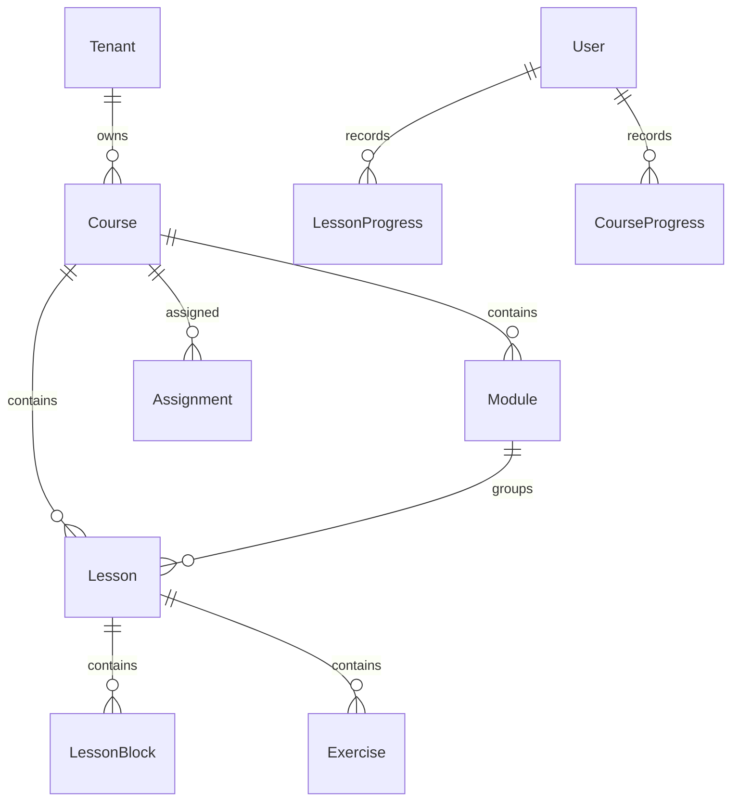
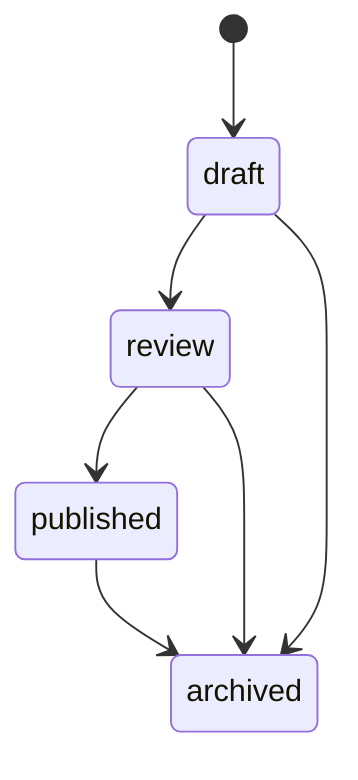

# Learning Domain Model

## Core Entities

`Course`

- Tenant-scoped learning container.
- Has language, track type, target level, status, slug, version, and publish timestamp.
- Unique slug per tenant.

`Module`

- Ordered course section.
- Belongs to one course and tenant.

`Lesson`

- Atomic learner unit.
- Belongs to one course and module.
- Has language, target level, estimated minutes, objectives, status, and version.
- Unique slug per tenant and course.

`LessonBlock`

- Ordered lesson content block.
- Supported types: text, dialogue, vocabulary, grammar, listening, speaking prompt, quiz, reflection.
- Stores typed content in JSON for PR-004 flexibility.

`VocabularyItem`

- Tenant-scoped lexical item with term, reading, romanization, meaning, part of speech, level, tags, and optional source reference.

`GrammarPoint`

- Tenant-scoped grammar point with pattern, explanation, examples, level, and optional source reference.

`Exercise`

- Tenant-scoped lesson exercise.
- Stores `answerKey`, but learner APIs remove it from responses.

`LessonProgress`

- Unique per `tenantId + userId + lessonId`.
- Tracks not started, in progress, completed, score, and activity timestamps.

`CourseProgress`

- Unique per `tenantId + userId + courseId`.
- Tracks completed lesson count, total lessons, progress percent, and last lesson.

`Assignment`

- Assigns a course to a user or group.
- Stores assignee type/id, assigned by, due date, and status.

## Relationships

## Status Lifecycle

## Visibility Rules

- Learner sees only published courses and published lessons.
- Content editor can see draft/review content but cannot publish.
- Tenant admin can publish.
- Archived content is hidden from learner paths.
- Cross-tenant data is never returned by repository methods.

## Tenant Isolation

- Every learning table has `tenantId`.
- Every repository method requires `tenantId`.
- API routes use centralized tenant context.
- Route handlers call service/repository layers, never Prisma directly.
