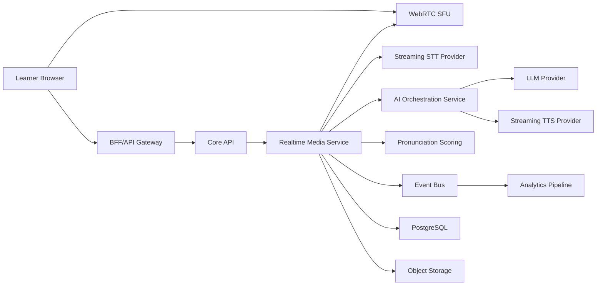
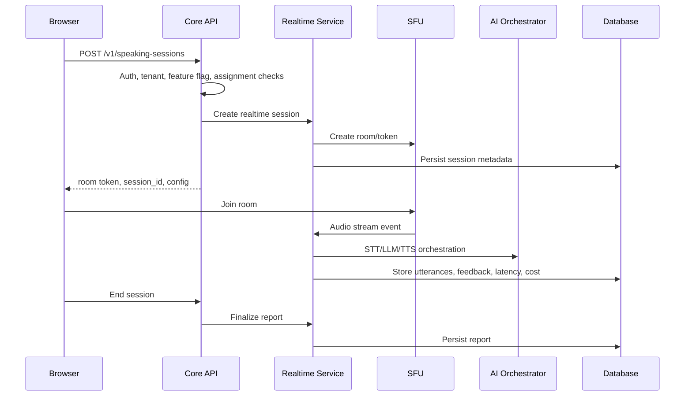

# Polyglot AI Academy - Realtime Speaking Architecture

## PR-006 implementation status

PR-006 implements the backend foundation only:

- tenant-scoped speaking sessions
- hashed realtime join token persistence
- text fallback transcript segments
- QoS metadata for adaptive bitrate, reconnect, and text fallback
- report scaffold with `scoringStatus=not_implemented`

The current provider names are mock placeholders:

- `mock-livekit`
- `mock-stt`
- `mock-tts`
- `mock-tutor-v1`

No real SFU, STUN/TURN, STT, TTS, or pronunciation provider is called yet.

## 1. Realtime product position

Speaking realtime is a core product surface, not a demo feature. The speaking loop must support enterprise learners on unreliable networks, track outcomes, and feed analytics/reporting for managers and L&D teams.

Primary outcomes:

- Increase weekly successful speaking minutes.
- Reduce repeated pronunciation and grammar errors.
- Give learners fast, actionable feedback.
- Give organizations cohort-level visibility.

## 2. Speaking loop UX

Every speaking session follows this rhythm:

1. Context:
   - Scenario.
   - Role.
   - Goal.
   - Useful phrases.
   - Target grammar/vocabulary.
2. User speaks:
   - Clear mic state.
   - VU meter.
   - Partial transcript realtime.
   - Timer.
   - Retry.
   - Text fallback if mic/network fails.
3. AI responds:
   - Voice + transcript.
   - Short response.
   - Corrects the highest-impact error.
   - "Try again" action.
4. Session report:
   - Fluency.
   - Pronunciation.
   - Grammar.
   - Vocabulary.
   - Relevance.
   - Top repeated mistakes.
   - Suggested drills.
   - Next micro-goal.

## 3. Architecture decision

Default:

- WebRTC through SFU, not pure P2P, for production.
- LiveKit is the default candidate because it supports managed and self-hosted paths, enterprise flexibility, SFU, room tokens, and media control.

Alternatives:

| Provider          | Strength                                              | Tradeoff                                       | Use when                            |
| ----------------- | ----------------------------------------------------- | ---------------------------------------------- | ----------------------------------- |
| LiveKit           | Flexible, managed/self-host, strong WebRTC primitives | Requires more product/media ownership          | Enterprise control matters          |
| Agora             | Fast global media infra                               | More vendor-specific                           | Fast launch with less infra control |
| Daily             | Simple developer experience                           | Less deep control for complex enterprise media | Rapid prototype                     |
| Custom WebRTC/SFU | Maximum control                                       | High engineering burden                        | Only with strong media team         |

Recommendation:

- MVP/V1: LiveKit managed or self-host depending enterprise constraints.
- Avoid pure P2P for production speaking because NAT traversal, recording, reconnection, QoS, and analytics are harder.

## 4. Service topology

## 5. Session lifecycle

## 6. Signaling and session token

Token contents:

- `session_id`
- `tenant_id`
- `user_id`
- `role`
- `room_id`
- `expires_at`
- allowed media permissions.
- language.
- scenario.
- region.

Rules:

- Token is short-lived.
- Token is scoped to one room/session.
- Token is generated server-side after authz.
- Token cannot be reused after session closes.
- Token issuance is audit/event logged for enterprise analytics.

## 7. STUN/TURN

Requirements:

- Managed STUN/TURN for MVP if using LiveKit managed.
- Self-hosted TURN option for enterprise/self-host path.
- Monitor TURN usage rate and failures.
- Use region-aware TURN allocation where possible.

Metrics:

- ICE connection success rate.
- Time to connected.
- TURN fallback rate.
- Reconnect success rate.

## 8. QoS and network fallback

Network weak mode:

- Disable nonessential visual effects.
- Reduce bitrate.
- Prefer mono audio.
- Lower packetization overhead where provider supports.
- Keep transcript updates.
- Switch voice response to text if TTS/voice path fails.
- Never lose session state.

Reconnect:

- Keep session state in backend.
- Client retries with exponential backoff.
- Resume transcript from last confirmed turn.
- Mark partial turn if audio loss occurs.
- User can retry last utterance.

Fallback ladder:

1. Full duplex voice.
2. Push-to-talk voice.
3. Audio upload with async feedback.
4. Text fallback with speaking report unavailable notice.

## 9. Latency budget

Targets:

| Segment                       | Target                                           |
| ----------------------------- | ------------------------------------------------ |
| Session setup                 | p95 < 2s                                         |
| First partial STT             | p95 300-500ms                                    |
| Final STT after utterance end | p95 < 800ms                                      |
| LLM first token               | p95 < 700ms after final transcript               |
| TTS first byte                | p95 < 800ms                                      |
| AI audible reply start        | target 800-1500ms after user turn where feasible |
| Report generation             | async allowed, p95 < 15s                         |

Instrumentation:

- Browser timestamps.
- SFU connection events.
- STT partial/final timestamps.
- LLM request/first-token/complete.
- TTS first-byte/complete.
- Pronunciation scoring start/end.
- Report start/end.

## 10. Data model additions

SpeakingSession:

- `id`
- `tenant_id`
- `user_id`
- `lesson_id`
- `scenario_id`
- `roleplay_type`
- `stt_provider`
- `tts_provider`
- `llm_provider`
- `status`
- `latency_ms`
- `cost_estimate`
- `started_at`
- `ended_at`

Utterance:

- `id`
- `session_id`
- `speaker`
- `raw_audio_uri`
- `transcript_raw`
- `transcript_normalized`
- `romanization`
- `confidence`
- `language`
- `grammar_tags`
- `level_tag`
- `tts_voice_profile`

FeedbackItem:

- `id`
- `utterance_id`
- `category`
- `severity`
- `suggestion`
- `rubric_tag`
- `confidence`

## 11. Synthetic realtime tests

Required tests:

- Session token cannot join another tenant room.
- Reconnect resumes session without losing transcript.
- Weak network fallback works.
- Text fallback works when mic permission denied.
- STT provider outage degrades gracefully.
- TTS provider outage returns text response.
- Report still generates when pronunciation provider is delayed.
- Latency metrics are emitted.
- Cross-tenant room access fails.

## 12. Realtime Architecture Done Criteria

- WebRTC/SFU design is explicit.
- Session token, signaling, reconnect, QoS, and fallback are defined.
- Latency budget and metrics are defined.
- Speaking data model supports tenant, transcript, romanization, and feedback.
- Synthetic tests cover failure modes and cross-tenant isolation.
