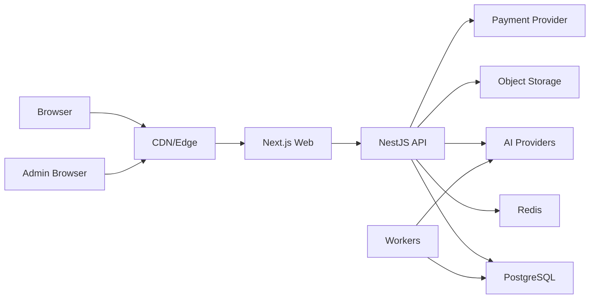
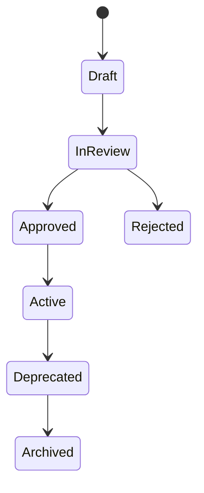

# Polyglot AI Academy - Security and Privacy Plan

## 1. Security posture

Security target:

- Secure-by-default web application.
- OWASP ASVS Level 2 baseline for MVP.
- Level 3-style rigor for admin, payment, audio, AI, and sensitive learning data where feasible.
- OWASP Top 10, OWASP API Security Top 10, OWASP GenAI/LLM risks, and STRIDE threat modeling used as operating references.
- WCAG 2.2 AA accessibility target for user-facing UI.

This document is a product security plan, not a certification claim. External certification requires an independent audit and evidence package.

## 2. Assets and trust boundaries

Critical assets:

- User identity and sessions.
- Password hashes and reset tokens.
- Learner profile, goals, levels, progress.
- Chat messages and AI memory.
- Speaking audio, transcripts, pronunciation reports.
- Admin CMS content and prompt templates.
- Content source/license records.
- Payment/subscription records.
- API keys, provider credentials, database credentials.
- Audit logs.

Trust boundaries:

Boundary rules:

- Browser is untrusted.
- Frontend authorization is UX only.
- API validates every request at runtime.
- AI output is untrusted until schema/policy validation passes.
- Retrieved RAG content is untrusted until source allowlist and content policy checks pass.
- Admin actions require server-side permissions and audit logs.

## 3. STRIDE threat model summary

| Threat                 | Example                                        | Control                                                            |
| ---------------------- | ---------------------------------------------- | ------------------------------------------------------------------ |
| Spoofing               | Stolen session, fake admin                     | Secure sessions, rotation, 2FA optional, device/session management |
| Tampering              | Modify lesson ID to access unpublished content | Object-level authorization, validation, immutable audit            |
| Repudiation            | Admin denies publishing bad content            | Audit logs with actor, timestamp, before/after                     |
| Information disclosure | User accesses another user's transcript        | Ownership checks, RBAC, encryption, no-store cache headers         |
| Denial of service      | Login brute force, AI cost abuse               | Rate limit, quotas, queues, request limits, circuit breakers       |
| Elevation of privilege | Content editor reaches super admin functions   | Permission checks on every admin API, tests, least privilege       |

## 4. Authentication requirements

Controls:

- Password hashing: Argon2id preferred, bcrypt allowed with strong cost if Argon2id unavailable.
- Email verification before sensitive actions or full product access.
- Password reset token:
  - random high entropy.
  - hashed at rest.
  - one-time use.
  - short expiry.
- Session rotation after login, password reset, privilege change.
- Refresh token rotation if JWT strategy is used.
- Login rate limit by IP and account.
- Soft lockout or progressive delay for brute force.
- Optional 2FA for user, strongly recommended/required for admin.
- Secure cookie attributes in production: `HttpOnly`, `Secure`, `SameSite=Lax` or stricter.
- Logout invalidates current session/refresh token.

Acceptance criteria:

- No raw password ever logged.
- No reset token stored in plaintext.
- Auth endpoints covered by integration tests and rate limit tests.
- Admin accounts can require 2FA before launch.

## 5. Authorization requirements

RBAC roles:

- `super_admin`
- `content_editor`
- `teacher`
- `support`
- `analyst`
- `learner`

Permission model:

- Role grants permissions.
- Sensitive actions check explicit permission.
- User-owned resources check ownership.
- Admin resource access checks role and permission.

Examples:

| Permission          | Roles                                | Notes                          |
| ------------------- | ------------------------------------ | ------------------------------ |
| `user:read_basic`   | support, tenant_admin, super_admin   | Redacted by default            |
| `content:create`    | content_editor, teacher, super_admin | Draft only                     |
| `content:publish`   | content_editor, super_admin          | Requires validation pass       |
| `source:approve`    | super_admin, legal/content lead      | Requires license review        |
| `audit:list`        | security_auditor, tenant_admin       | Tenant-scoped immutable log    |
| `audit:export`      | security_auditor, super_admin        | Requires step-up MFA           |
| `data:export`       | data_protection_officer, super_admin | Requires step-up MFA           |
| `sso_config:update` | tenant_admin, super_admin            | Requires step-up MFA and audit |

Acceptance criteria:

- No admin route relies only on frontend hiding.
- API tests verify permission denial.
- Object-level tests verify user cannot read another user's progress/audio/chat.

## 6. Input validation and output safety

Requirements:

- Zod/class-validator for every request body, params, query.
- TypeScript types are not runtime security.
- Reject unknown fields for sensitive actions where possible.
- Normalize IDs, language codes, enum values.
- Request size limits per endpoint.
- Rich text sanitization using vetted sanitizer.
- No raw `dangerouslySetInnerHTML` with untrusted content.
- No SQL string concatenation; use Prisma/parameterized queries.
- No user-controlled filesystem paths.
- File uploads:
  - allowlist file types.
  - enforce max size.
  - inspect content type.
  - generate server filenames.
  - store outside public web root.
  - malware scan if product accepts arbitrary files later.

Acceptance criteria:

- Validation errors use standard error format.
- Backend validation exists even when frontend validates.
- Upload endpoint rejects wrong type/size.

## 7. API security

Controls:

- `/v1` API versioning.
- Authentication guard.
- Permission guard.
- Object ownership guard/policy.
- Rate limit:
  - login/register/reset.
  - AI chat.
  - speaking session creation.
  - upload.
  - admin mutation.
- Request size limit.
- Strict CORS allowlist.
- CSRF protection for cookie-auth state-changing endpoints.
- Security headers:
  - Content-Security-Policy.
  - X-Content-Type-Options.
  - Referrer-Policy.
  - frame-ancestors via CSP or X-Frame-Options.
  - Permissions-Policy.
- Idempotency key:
  - payment.
  - subscription changes.
  - expensive AI generation.
- Standard error response with request ID.
- No stack traces in production responses.

Acceptance criteria:

- State-changing endpoints require auth and CSRF/origin protection depending auth mode.
- CORS never reflects arbitrary origin.
- Error responses do not leak internals.

## 8. Data privacy

Controls:

- TLS everywhere in production.
- PII minimization.
- Encrypt sensitive data at rest where needed.
- Audio storage separated from public assets.
- Signed URLs for private audio.
- User data export/delete workflow.
- Audio retention default short unless consent extends it.
- Chat history retention configurable/deletable.
- Mask PII and tokens in logs.
- No `Authorization`, cookies, reset tokens, provider keys in logs.
- Analytics events avoid raw message/audio/transcript.

Consent categories:

- Required processing consent for product functionality.
- Optional AI improvement/training consent.
- Optional marketing/testimonial consent.
- Cookie/tracking consent where applicable.

Acceptance criteria:

- User can request deletion of learning data.
- Product does not use raw audio for training without opt-in.
- Logs redact sensitive fields.

## 9. AI security

Threats:

- Prompt injection from user.
- Prompt injection from RAG/source content.
- Jailbreak asking for system prompt.
- AI hallucinating grammar/vocab facts.
- AI generating unsafe/off-topic content.
- AI leaking another user's memory.
- Tool abuse.
- Cost abuse.

Controls:

- Instruction hierarchy: system > developer/config > source context > user message.
- Prompt templates versioned and approved.
- Strict input and output schemas.
- User message moderation.
- Retrieved content source allowlist.
- Prompt injection detection on user input and retrieved snippets.
- RAG citations only from validated sources.
- AI cannot call tools unless explicitly allowed by service policy.
- Tool scopes are narrow and audited.
- Refuse or redirect when user asks outside locked learning scope.
- No system prompt exposure.
- No fake citations.
- Cost tracking by user, feature, provider, model.
- Quotas and circuit breakers.
- Age-sensitive mode foundation if product serves under-18 learners.

Acceptance criteria:

- Prompt eval suite includes jailbreak, prompt leak, fake citation, unsafe content, off-scope requests.
- AI output must pass schema validation.
- Generated lesson content stays draft until validation workflow passes.

## 10. Prompt template governance

Required fields:

- `prompt_id`
- `version`
- `purpose`
- `input_schema`
- `output_schema`
- `safety_rules`
- `eval_tests`
- `created_by`
- `approved_by`
- `created_at`
- `approved_at`
- `status`

Lifecycle:

Rules:

- Only one active version per purpose/persona/language mode unless feature-flagged.
- Prompt edits create a new version.
- Production prompt requires eval tests and approval.
- Rollback to previous active prompt must be possible.

## 11. Compliance and legal baseline

Requirements:

- Privacy Policy.
- Terms of Service.
- AI disclosure.
- AI Safety page.
- Data Sources page.
- Cookie consent if tracking cookies/non-essential analytics are used.
- GDPR-style rights:
  - access.
  - deletion.
  - correction.
  - portability where practical.
  - consent withdrawal.
- Data Processing Agreement placeholder for B2B/enterprise.
- License registry for all third-party/open datasets.
- Attribution handling for sources requiring attribution.

Acceptance criteria:

- No public claim about certification/compliance without evidence.
- Data source page reflects approved sources and license obligations.

## 12. Infrastructure and secret management

Controls:

- Secrets in secret manager or platform env, never committed.
- `.env*` ignored except safe examples.
- Separate credentials per environment.
- Least privilege DB/service accounts.
- CI has minimal permissions.
- Dependency lockfiles enforced.
- SAST, dependency scanning, secret scanning in CI.
- Container image scanning when Docker images are built.
- Backups encrypted and tested.
- Rollback plan for deployments and migrations.

Acceptance criteria:

- CI fails on detected secret patterns.
- Production deploy uses production build, not dev server.
- Health checks and alerts configured.

## 13. Security testing plan

Required tests:

- Unit tests for auth token generation/expiry.
- Integration tests for login/register/reset/verify.
- RBAC matrix tests.
- Object-level authorization tests.
- Rate limit tests.
- CSRF/origin validation tests if cookie auth.
- Input validation tests for each endpoint.
- Upload restriction tests.
- AI safety evals.
- Prompt template schema tests.
- Data source license gate tests.
- Dependency scan.
- Secret scan.
- DAST smoke for public staging.
- API fuzz testing for critical endpoints.
- Manual threat model review before launch.

## 14. Security backlog

P0:

- Auth secure baseline.
- RBAC and object-level authorization.
- Audit log for admin.
- Validation for all endpoints.
- AI output schema validation.
- Source/validation gate for content publish.
- Log redaction.
- Rate limits on auth and AI.

P1:

- Optional 2FA.
- CSP report-only then enforce.
- SAST/dependency/secret scan CI.
- Data deletion/export workflow.
- Signed audio URLs.
- Prompt eval dashboard.

P2:

- Advanced anomaly detection.
- Enterprise SSO.
- Tenant isolation if B2B.
- Dedicated secrets rotation automation.
- Formal external penetration test.

## 15. Security Done Criteria

- No hard-coded secrets.
- Auth and protected endpoints tested.
- RBAC and object-level access tested.
- Admin mutations audited.
- Backend validates every request.
- AI prompts versioned and evaluated.
- AI output schema validated.
- Logs redact sensitive fields.
- Audio/chat retention policy implemented.
- Content cannot publish without source and validation.
- CI includes at least typecheck, lint, tests, dependency scan, and secret scan before launch.

## 16. Reference standards and resources

- OWASP ASVS: https://owasp.org/www-project-application-security-verification-standard/
- OWASP Top 10: https://owasp.org/www-project-top-ten/
- OWASP API Security Top 10: https://owasp.org/API-Security/
- OWASP Cheat Sheet Series: https://cheatsheetseries.owasp.org/
- OWASP GenAI Security Project: https://genai.owasp.org/
- W3C WCAG 2.2: https://www.w3.org/TR/WCAG22/

## 17. Enterprise security upgrade

Enterprise auth architecture:

- OAuth 2.0 + OpenID Connect.
- Authorization Code + PKCE for browser app.
- SAML bridge only for legacy enterprise compatibility.
- No implicit flow.
- Refresh token rotation.
- Idle timeout.
- Absolute timeout.
- Session/device revocation.
- Step-up MFA for sensitive actions:
  - data export.
  - tenant policy change.
  - sensitive transcript/audio access.
  - SSO changes.
  - data deletion.

Authorization:

- RBAC for role grants.
- ABAC for tenant/site/course/document context.
- Deny-by-default.
- Object-level authorization required.
- Cross-tenant access tests are release blockers.

Enterprise roles:

- `super_admin`
- `tenant_admin`
- `lnd_manager`
- `content_editor`
- `linguist_reviewer`
- `teacher`
- `learner`
- `support`
- `security_auditor`
- `data_protection_officer`

SCIM v1 requirements:

- User provisioning.
- Group sync.
- Deprovisioning.
- Role/group mapping.
- Audit every sync event.

Additional threat model categories:

- Prompt injection.
- RAG poisoning.
- Cross-tenant leakage.
- Tool misuse.
- Data exfiltration.
- Tenant document contamination.
- Compromised admin account.

Sensitive enterprise data:

- transcript.
- audio.
- enterprise glossary.
- tenant documents.
- learner analytics.
- manager reports.

Additional controls:

- KMS-backed secrets.
- Envelope encryption for sensitive audio/transcript where required.
- No raw production DB access except audited break-glass.
- Malware scan for uploaded tenant documents.
- RAG document quarantine before indexing.
- Tenant-specific provider/data residency policy.
