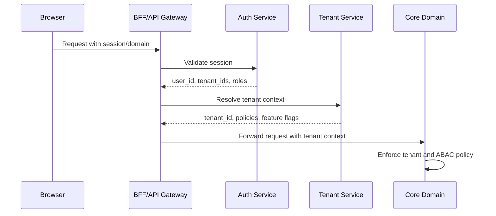
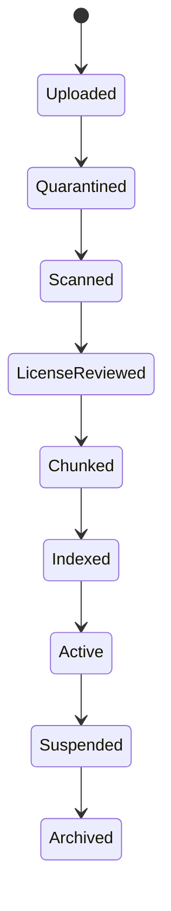

# Polyglot AI Academy - Tenant Architecture

## 1. Tenant architecture goals

The platform must support enterprise tenants from day one. A tenant can be a company, school, language center, training organization, or international program. The core requirement is strong logical isolation with a path to stricter regional and deployment isolation later.

Goals:

- Prevent cross-tenant data leakage.
- Support tenant branding, glossary, documents, agents, policies, feature flags, and analytics.
- Enable OIDC/SCIM integration.
- Keep business core as a modular monolith while realtime, AI orchestration, and data pipeline scale independently.

## 2. Isolation model

Recommended MVP isolation:

- Shared application runtime.
- Shared PostgreSQL cluster.
- Tenant-partitioned tables with mandatory `tenant_id`.
- Tenant-scoped object storage prefixes.
- Tenant-scoped vector/RAG filters.
- Tenant-scoped encryption context.
- Tenant-aware logs/metrics without raw sensitive content.

Future isolation tiers:

| Tier       | Use case                    | Isolation                                               |
| ---------- | --------------------------- | ------------------------------------------------------- |
| Standard   | SMB/team tenants            | Shared DB, row-level tenant isolation                   |
| Enterprise | Larger customers            | Dedicated schema or DB option, stronger encryption keys |
| Regulated  | Strict residency/compliance | Region-pinned infrastructure and storage                |
| Private    | V2 private deployment       | Dedicated stack                                         |

## 3. Tenant resolution

Tenant context sources:

- Authenticated session claim.
- Subdomain or custom domain.
- OIDC issuer mapping.
- SCIM bearer token mapping.
- Admin-selected tenant for super admin only.

Resolution flow:



Rules:

- No tenant context means deny for tenant resources.
- Tenant context is immutable during a request.
- Super admin tenant switching requires explicit audit event.
- Tenant ID from client input is never trusted by itself.

## 4. Database rules

Required:

- Every tenant-owned table includes `tenant_id`.
- Composite indexes use `tenant_id` first where appropriate.
- Public IDs use UUID/CUID, not sequential IDs.
- Queries use tenant-scoped repository helpers.
- Cross-tenant admin queries are separate code paths and audit logged.
- Row Level Security can be added for defense-in-depth after repository policy is stable.

Examples:

```text
tenant_id + user_id
tenant_id + group_id
tenant_id + course_id
tenant_id + assignment_id
tenant_id + document_id
tenant_id + agent_id
tenant_id + speaking_session_id
```

Cross-tenant test strategy:

- Attempt learner A in tenant A accessing tenant B lesson/progress/transcript.
- Attempt manager in tenant A accessing tenant B cohort analytics.
- Attempt tenant document retrieval across tenant IDs.
- Attempt RAG search without tenant filter.
- Attempt object storage signed URL for other tenant prefix.
- Attempt SCIM token from tenant A provisioning tenant B.
- Attempt prompt/agent update across tenant.

All must fail with `403` or `404` without leaking resource existence unless admin policy explicitly allows.

## 5. Tenant branding

Branding config:

- logo URL.
- favicon URL.
- primary color token.
- accent color token.
- email header/footer.
- legal footer copy.
- allowed auth methods.
- default learner landing route.

Constraints:

- Branding cannot break WCAG 2.2 AA contrast.
- Tenant colors map into a safe token system, not arbitrary full-theme override.
- Admin preview must show desktop/tablet/mobile.
- Branding changes are audited.

## 6. Tenant feature flags

Feature flags:

- speaking realtime.
- AI tutor.
- tenant knowledge agent.
- exam prep.
- content studio.
- glossary.
- SCIM.
- SAML bridge.
- exports.
- advanced analytics.
- data retention controls.

Rules:

- Flags are tenant-scoped with optional group/user overrides.
- Risky AI/realtime features can be canaried by tenant.
- Flag changes are audited.
- Backend enforces flags, frontend only adapts UI.

## 7. Tenant agents

Agent scopes:

| Agent                     | Scope                     | Tenant behavior                                 |
| ------------------------- | ------------------------- | ----------------------------------------------- |
| Tutor Coach Agent         | Current lesson/course     | Can use tenant assignments and learner progress |
| Pronunciation Coach Agent | Speaking session          | Can use tenant speaking rubric                  |
| Tenant Knowledge Agent    | Tenant documents/glossary | Must not answer outside tenant source scope     |
| Exam Prep Agent           | CEFR/JLPT/HSK/TOPIK       | Can use tenant-selected exam path               |
| Content QA Agent          | Content Studio            | Checks tenant content policy and source/license |

Agent record:

- `agent_id`
- `tenant_id`
- `scope`
- `allowed_tools`
- `prompt_version`
- `policy_version`
- `output_schema`
- `eval_tests`
- `status`
- audit log references

Rules:

- Agents are deny-by-default.
- Tool use requires allow-list.
- Tenant Knowledge Agent only retrieves from tenant documents and approved shared content.
- Agent output is schema validated.
- Prompt and policy changes require versioning, evals, and approval.

## 8. Tenant documents and RAG

Document lifecycle:



Required controls:

- Malware scan before processing.
- License and allowed usage check.
- PII/sensitive content classification.
- Chunk-level tenant ID and access scope.
- Embeddings cannot be shared across tenants.
- Retrieval filters must include tenant ID and document access scope.
- Document deletion must remove chunks and embeddings.

## 9. Tenant glossary

Fields:

- `id`
- `tenant_id`
- `term`
- `definition`
- `language`
- `domain`
- `usage_note`
- `approved_by`
- `status`
- `version`

Rules:

- Glossary terms are reviewed before used in agent grounding.
- Glossary can override generic terminology inside tenant context.
- Learner-facing glossary output shows source: tenant glossary.
- Glossary changes are audited.

## 10. Data residency model

Tenant config:

- `data_residency`: `us`, `eu`, `apac`, `jp`, `kr`, or `global` initially as config.
- `storage_region`.
- `processing_region`.
- `ai_provider_region_constraints`.
- `subprocessor_policy`.

MVP:

- Capture requirements and enforce storage region where provider supports it.
- Do not promise hard residency until routing/storage/provider controls are implemented and verified.

V1:

- Region-aware storage and processing.
- Region-pinned object storage.
- Tenant-level provider allowlist.
- Data transfer matrix and export evidence.

## 11. Audit model

Audit every:

- SSO config change.
- SCIM sync event.
- Role or permission change.
- Tenant policy change.
- Data export.
- Transcript/audio access by admin/support.
- Prompt/policy/agent update.
- Content publish/rollback.
- Tenant document upload/delete/index.
- Super admin tenant switch.

Audit fields:

- tenant_id.
- actor_id.
- action.
- resource_type.
- resource_id.
- before.
- after.
- ip.
- user_agent.
- created_at.
- request_id.

## 12. Tenant Architecture Done Criteria

- Every tenant-owned data path has a tenant context.
- Cross-tenant tests are defined and release-blocking.
- Tenant branding, glossary, documents, agents and feature flags have clear boundaries.
- RAG retrieval cannot cross tenant scope.
- Data residency is represented as a config and not over-claimed before enforcement.
